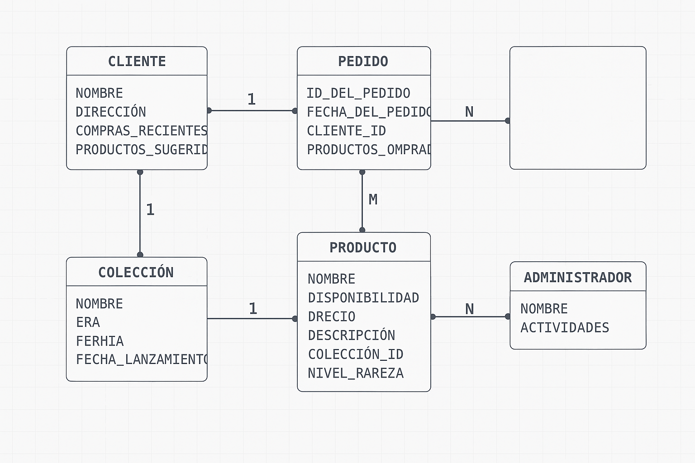

### Entidades y atributos con tipos de datos:

1. **Cliente**:
   - Nombre: `VARCHAR(100)`
   - Dirección: `TEXT`
   - Compras recientes: `JSON` (para guardar una lista de productos u órdenes recientes)
   - Productos sugeridos: `JSON` (una lista de sugerencias personalizada)

2. **Producto**:
   - Nombre: `VARCHAR(100)`
   - Disponibilidad: `INTEGER` (cantidad en stock)
   - Precio: `DECIMAL(10,2)` (para manejar precios con decimales)
   - Descripción: `TEXT`
   - Colección: `VARCHAR(100)` (clave foránea que enlaza con el nombre de la colección)
   - Nivel de rareza: `VARCHAR(50)`

3. **Colección**:
   - Nombre: `VARCHAR(100)` (clave primaria)
   - Era: `VARCHAR(50)` (por ejemplo, "Base Set", "Jungle", etc.)
   - Rareza: `VARCHAR(50)` (rango general de rareza, como "común", "raro", etc.)
   - Fecha de lanzamiento: `DATE`

4. **Pedido**:
   - ID del pedido: `INTEGER` (clave primaria, auto incrementable)
   - Fecha del pedido: `DATETIME`
   - Cliente: `INTEGER` (clave foránea al ID del cliente)
   - Productos: `JSON` (para registrar detalles de los productos en el pedido)

5. **Administrador**:
   - Nombre: `VARCHAR(100)`
   - Actividades: `TEXT` (descripción general de las tareas realizadas)

### Relaciones y cardinalidad:

### Reglas y Restricciones

#### Reglas Generales de Compra

- **Máximo por carta individual**  
  Cada usuario podrá adquirir como máximo **4 copias** de una misma carta por mes (salvo excepciones específicas).

- **Límite semanal de compra**  
  Cada cuenta tiene un límite de **20 cartas sueltas por mes**.

- **Cartas raras o limitadas**  
  Las cartas consideradas **raras, holográficas o de edición limitada** estarán restringidas a **1 unidad por persona cada mes**.

- **Prohibida la compra con fines de reventa**  
  Queda terminantemente prohibido comprar cartas para reventa inmediata. Las cuentas que incurran en esta práctica podrán ser bloqueadas.

- **Stock sujeto a disponibilidad**  
  Las compras están sujetas a disponibilidad. Nos reservamos el derecho de limitar compras en caso de detectar acaparamiento.

---

#### Políticas de Envío y Devoluciones

- **Verificación de dirección**  
  Asegúrate de ingresar correctamente tu dirección. No nos responsabilizamos por pérdidas debido a errores en los datos proporcionados.

- **No se aceptan devoluciones**  
  Todas las ventas de cartas sueltas son **finales**, a excepción de productos defectuosos o errores en el envío (previa revisión).

- **Pedidos múltiples**  
  No está permitido hacer múltiples pedidos diarios para evadir restricciones. Esto puede conllevar cancelación automática.

---

#### Reglas del Usuario

- **Una cuenta por persona**  
  Está prohibido utilizar múltiples cuentas. Se permitirá **una única cuenta por usuario**, y el uso de más será motivo de sanción.

- **Conducta y respeto**  
  Se espera un trato respetuoso hacia el equipo de la tienda y otros usuarios. Cualquier falta será sancionada.

---

#### Prevención de Inflación y Especulación

- **Precios dinámicos**  
  Algunos precios podrán ajustarse según la oferta y la demanda para evitar acaparamiento.

- **Bloqueo temporal de cartas especulativas**  
  Las cartas que se sospeche estén siendo objeto de especulación serán retiradas temporalmente del catálogo hasta normalizarse el mercado.

