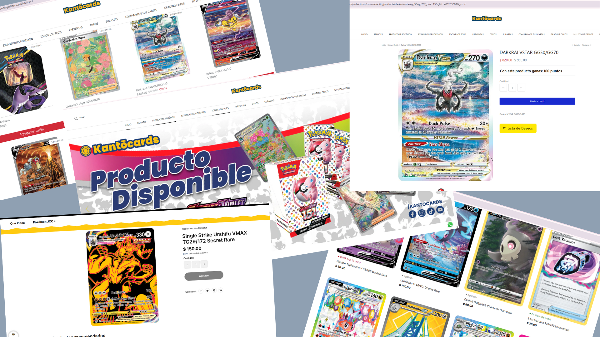
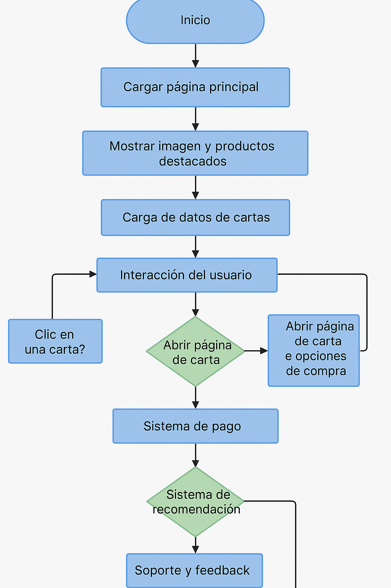

# 
 Nombre Tienda: TCG Corner 

---

- ## Descripción de la tienda: 
En estatienda se venderán cartas pokemon sueltas de alto valor para que los coleccionistas de estas costosas cartas no se arriesguen a comprar demasiados productos para conseguir una sola carta sin excito.

| Nombre                     | Descripción                                      | Precio Aproximado |
|----------------------------|--------------------------------------------------|-------------------|
| Giratina VSTAR             | Carta legendaria con diseño espectacular.       | $173.96           |
| Mewtwo VSTAR               | Carta poderosa con habilidades psíquicas.       | $115.69           |
| Arceus VSTAR               | Carta divina con gran valor coleccionable.      | $118.37           |
| Origin Forme Dialga VSTAR  | Carta especial de Dialga en su forma original.  | $83.94            |
| Origin Forme Palkia VSTAR  | Carta especial de Palkia en su forma original.  | $79.00            |
| Suicune V                  | Carta de Suicune con diseño artístico único.    | $35.91            |
| Raikou V                   | Carta de Raikou con habilidades eléctricas.     | $29.53            |
| Entei V                    | Carta de Entei con diseño volcánico impresionante. | $30.99            |
| Glaceon VSTAR              | Carta de Glaceon con habilidades de hielo.      | $36.50            |
| Deoxys VMAX                | Carta de Deoxys con diseño futurista.           | $39.99            |
| Hisuian Zoroark VSTAR      | Carta de Zoroark con diseño oscuro y elegante.  | $19.88            |
| Pikachu (Secret Rare)      | Carta de Pikachu con varios amigos Galarianos.  | $15.83            |
| Cynthia's Ambition         | Carta de entrenador con diseño artístico.       | $18.97            |
| Elesa's Sparkle            | Carta de entrenador con temática vibrante.      | $16.44            |
| Radiant Charizard          | Carta de Charizard con diseño radiante.         | $5.00             |

- ## MoodBoard

- ## Algoritmo
1. Inicio de la tienda:

- Cuando un usuario ingrese al sitio web, el sistema cargará la página principal.

- Se mostrará una imagen llamativa en la parte superior con los últimos productos agregados a la tienda.

- A continuación, se presentará un carrusel o una cuadrícula con los productos destacados (cartas más caras, populares o en promoción).

2. Carga de productos:

- La tienda obtendrá los datos de las cartas disponibles desde una base de datos.

- Cada carta incluirá nombre, descripción, precio y una imagen.

- Se organizarán las cartas en diferentes categorías, como “Más vendidas”, “Novedades” y “Ofertas especiales”.

3. Interacción del usuario:

- Si el usuario hace clic en una carta, se abrirá una página con información detallada, incluyendo opciones de compra.

- Un botón de "Añadir al carrito" permitirá comprar varias cartas antes de proceder al pago.

- Se ofrecerá un buscador donde el usuario podrá filtrar cartas por nombre, tipo, precio o colección.

4. Sistema de pago:

- El usuario podrá acceder a su carrito de compras y revisar los artículos agregados.

- Se integrará un sistema de pago seguro con opciones como tarjeta de crédito, PayPal y pagos digitales.

- Una vez completado el pago, el sistema generará una confirmación y enviará detalles de la compra al usuario.

5. Gestión de inventario:

- La base de datos actualizará automáticamente el stock disponible después de cada compra.

- Si una carta se agota, se marcará como “No disponible” hasta que se reponga.

6. Sistema de recomendación:

- Basado en compras anteriores y preferencias del usuario, el sistema sugerirá cartas similares o colecciones relacionadas.

7. Soporte y feedback:

- Se incluirá un sistema de soporte donde los clientes podrán enviar preguntas o reportar problemas.

- Se solicitarán reseñas y comentarios sobre las cartas para ayudar a futuros compradores.

- ## Diagrama de Flujo
